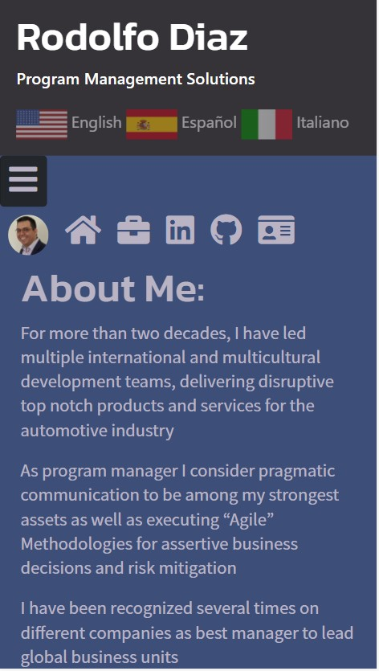
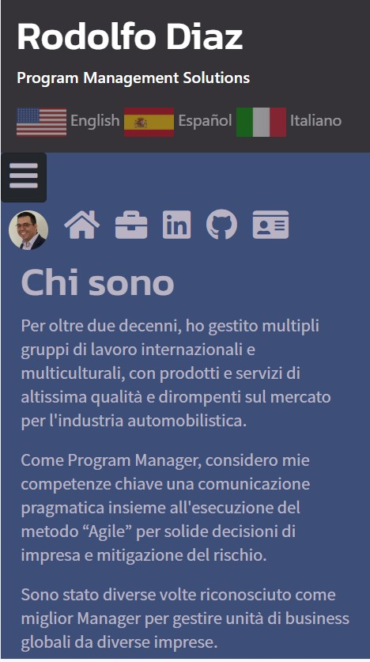
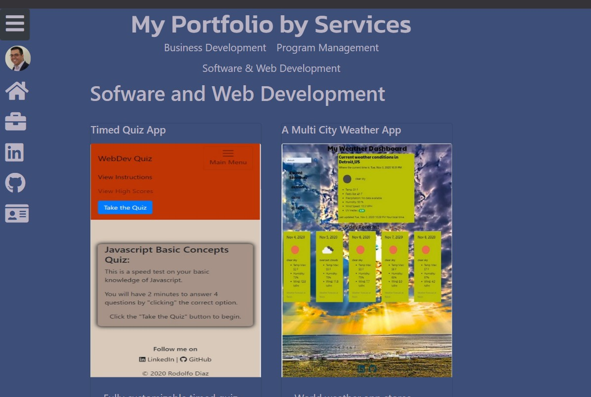

# My Portfolio 
An updated version of my portfolio 
  - Access this link to deploy the application:
    <https://rodolfod1.github.io/Updated_Portfolio/Index.html>

## My approach to this update  (Apply my book of knowledge):
- My need to research and learn different techniques enabled me to think outside the box on this project.
- For this version I have refactored the responsive portfolio and added user interactivity 
- A multi-cultural and multi-language approach.
- This version can be considered as the initial approach where it is heavy on HTML and CSS; However, jQuery is the heart of all the functionality. 
- Powered by Jquery all the CSS is generated and updated to comply with bootstrap 4.0 to give a responsive sense to the app, thinking on mobile first. 

## **  About the application **
* When the page loads:
  - The user is presented with a brief summary of myself and what I have done thru the years.
  - A Nav bar is deployed at the top where the user can select a language out of three options (English, Spanish and Italian).
  - There very similar HTML files have been created to comply with accessability requirements focusing on automatic and braille readers.
  - A hamburger button is deploying a side bar ( horizontal bar on mobile) with options for the user to navigate to the portfolio, contact, social media and github sections a goHome icon has been integrated.
  - A carousel is included on the footer to display news about me and additional skills - thinking into the commercial and marketing sides and usages of this.  
    
* This is an example of the page when it loads 

    

* Example of sidebar as secondary Nav

     

* Example of multi language interface:

    
 

* To run the application:
  - This application runs as soon it is deployed
  - user needs to interact selecting an item of the side bar .

* Style:
- Powered by jQuery designed using Bootstrap 4.0 a sober and bold style.

* Portfolio:
- This includes the most significative Web Applications I have developed as well as past life skills. 
- All web applications have a live link to the deployed site, this can be accessed when the images are clicked or tapped on the mobile version. 
   
   
 
 * About The CODE. 
  - Designed and Developed with jQuery keeping in mind it simplistic way to facilitate refactoring and debugging. 
  - Extensive use of Moment.js thru this application as a reinforcement exercise of the library (as personal touch).
  - Functions, LocalStorage, JSON , Objects and Events managers are deployed on this project. 
  
  

    *This Project contents:
  - Index.html - hosting the web page application all information is updated dynamically from the js file .
  - Script.js - Code for executing the app. 
  - style.css - simple style for the application.
  - README.md - this file.  
 
  =================================================================================
  ### How to best use this 
   - please fork and clone this repository

  ### Special Note for Testing:
  - just have fun.

 contact me at:
 https://github.com/Rodolfod1
 or direct email: rodolfodzr@gmail.com

 Rodolfo Diaz, Jan,13,2021

